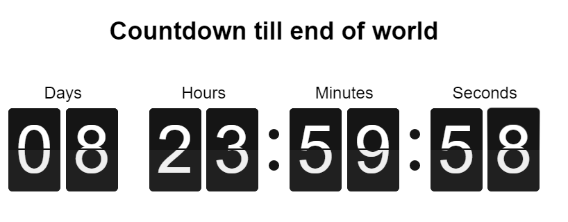

# electron-widget

> Widget POC using Electronjs

## Screenshot


## Dev

```
$ npm install
```

### Run

```
$ npm start
```

### Build

```
$ npm run build
```

Builds the app for macOS, Linux, and Windows, using [electron-packager](https://github.com/electron-userland/electron-packager).


## License

MIT © [arvindr21](https://thejackalofjavascript.com)
